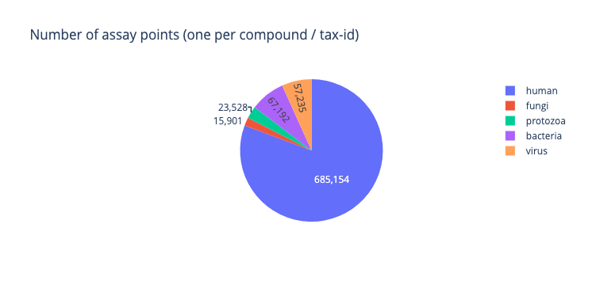
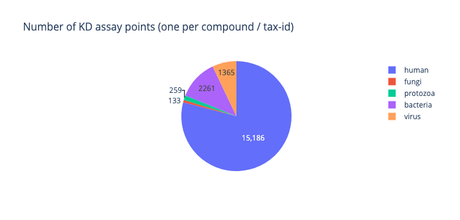

# Viral chEMBL
Brief survey of virus binding affinity data and crystallographic data.

## Aim

Hypothesis: there is a lot of data for viral and bacterial targets,
but crystallographic and affinity data is less prevalent, an issue that needs addressing.

## Binding affinity

### Parenthesis: Activity vs binding affinity

Normally Ki or IC50 (inhibition) is normally the preferred metric,
as the aim at the end of the day is to inhibit (most often) the activity.
However, this is measured via a bespoke assay for activity for that enzyme,
namely needs to be set up,
while binding affinity is more generalisable,
and is a measure of a single species binding, not two,
so is better for thermodynamic predictions and high throughput screening.

### Abundance

With the caveat that for non-human entries there is a large `target_id` issue
(see [test-herpesviridales.md](test-herpesviridales.md)),
and the `tax_id` may be patchy,
the number of assays shows that the data we have at hand is severely skewed towards humans.

Count of entries (not dedupicated) of top 20 activity types:

| standard_type         |   human |   fungi |   protozoa |   bacteria |   virus |     unknown |
|:----------------------|--------:|--------:|-----------:|-----------:|--------:|------------:|
| Potency               |   69,737 |       0 |          2 |          0 |       0 |   4,403,800 |
| IC50                  |  755,714 |  11,052 |     18,594 |     53,279 |  50,698 |   1,913,560 |
| GI50                  |    2,225 |       0 |          0 |          0 |       0 |   2,621,420 |
| Inhibition            |  318,233 |   6,488 |      7,739 |     22,846 |  14,947 |   1,162,210 |
| Percent Effect        |    8,841 |       0 |          0 |          0 |       0 |   1,319,520 |
| Activity              |  160,991 |   3,046 |      2,078 |     15,420 |   6,631 |   1,093,490 |
| Ki                    |  273,440 |   2,711 |      6,746 |     22,585 |   8,884 |     461,078 |
| MIC                   |       77 |      73 |         12 |      5,958 |      46 |     741,843 |
| EC50                  |   66,778 |     349 |        256 |      1,014 |   7,217 |     447,138 |
| INHIBITION            |        0 |       0 |          0 |          0 |       0 |     339,133 |
| AC50                  |    3,077 |     444 |          0 |        198 |     204 |     274,297 |
| Kd                    |  120,402 |     190 |        330 |      3,179 |   2,202 |      58,695 |
| Z score               |        0 |       0 |          0 |          0 |       0 |     147,592 |
| Ratio IC50            |   51,798 |     190 |        157 |        667 |   1,077 |      81,646 |
| GI                    |      150 |       0 |         10 |         30 |       0 |     129,140 |
| Tissue Severity Score |        0 |       0 |          0 |          0 |       0 |     128,999 |
| Ratio                 |   14,809 |     298 |        530 |      1,819 |   1,272 |     100,493 |
| ED50                  |      535 |       1 |          1 |         33 |      89 |     102,756 |
| CC50                  |      124 |       0 |          0 |         69 |      49 |      98,910 |
| IZ                    |       21 |      91 |          0 |        261 |       0 |      95,631 |

It is clear that problematic entries are problematic for multiple values,
such as ambiguous `standard_type` and missing `assay_tax_id` ("Unknown" in table above).

In terms of the viruses (one count per species per molecule):

Realm level:

| standard_type   |   Riboviria |   Duplodnaviria |   Monodnaviria |   Varidnaviria |
|:----------------|------------:|----------------:|---------------:|---------------:|
| IC50            |       30387 |            1645 |             63 |            169 |
| Inhibition      |        7979 |             457 |             54 |             22 |
| Ki              |        5495 |              83 |              1 |              6 |
| EC50            |        4183 |              88 |              0 |              0 |
| Activity        |        1857 |             545 |             37 |             25 |
| Kd              |         965 |              55 |              7 |              0 |
| Ratio           |         202 |               4 |              0 |              0 |
| ID50            |         331 |               4 |              0 |              0 |
| Ratio IC50      |         101 |               2 |              0 |              0 |
| EC90            |         687 |               0 |              0 |              0 |

Phylum level:

| phylum_id          |   IC50 |   Inhibition |   Ki |   EC50 |   Activity |   Kd |
|:-------------------|-------:|-------------:|-----:|-------:|-----------:|-----:|
| Artverviricota     |  14367 |         2861 | 3044 |   1054 |       1305 |  463 |
| Kitrinoviricota    |   8258 |         2446 | 1913 |   1719 |        136 |  228 |
| Negarnaviricota    |   4102 |         1214 |  248 |   1182 |        189 |  208 |
| Pisuviricota       |   3660 |         1457 |  290 |    228 |        225 |   66 |
| Peploviricota      |   1608 |          415 |   72 |     88 |        503 |   35 |
| Uroviricota        |     37 |           42 |   11 |      0 |         42 |   20 |
| Cossaviricota      |     63 |           54 |    1 |      0 |         33 |    7 |
| Nucleocytoviricota |    112 |           20 |    6 |      0 |         23 |    0 |
| Preplasmiviricota  |     57 |            2 |    0 |      0 |          2 |    0 |
| Duplornaviricota   |      0 |            1 |    0 |      0 |          2 |    0 |
| Phixviricota       |      0 |            0 |    0 |      0 |          4 |    0 |

Family level:

| family_id          |   IC50 |   Inhibition |   Ki |   EC50 |   Activity |   Kd |
|:-------------------|-------:|-------------:|-----:|-------:|-----------:|-----:|
| Retroviridae       |  14309 |         2726 | 3044 |    798 |       1217 |  463 |
| Flaviviridae       |   8257 |         2443 | 1910 |   1703 |        136 |  228 |
| Orthomyxoviridae   |   3530 |          877 |  248 |    187 |         92 |  194 |
| Coronaviridae      |   2936 |         1134 |  168 |    109 |        196 |   55 |
| Orthoherpesviridae |   1606 |          415 |   72 |     86 |        503 |   35 |
| Straboviridae      |     25 |           31 |    0 |      0 |          9 |   20 |
| Filoviridae        |    263 |          125 |    0 |     90 |         63 |   12 |
| Picornaviridae     |    452 |          288 |  105 |    107 |         27 |   11 |
| Papillomaviridae   |     28 |           49 |    1 |      0 |          5 |    7 |
| Rhabdoviridae      |     74 |           61 |    0 |      0 |         10 |    2 |
| Solemoviridae      |      0 |            0 |    0 |      0 |          1 |    0 |
| Mesoniviridae      |      0 |            0 |    4 |      0 |          0 |    0 |
| Autographiviridae  |      9 |            0 |    0 |      0 |         17 |    0 |
| Dicistroviridae    |      0 |            1 |    0 |      0 |          0 |    0 |
| Polyomaviridae     |     35 |            5 |    0 |      0 |         28 |    0 |
| Sedoreoviridae     |      0 |            1 |    0 |      0 |          2 |    0 |
| Potyviridae        |      1 |            0 |    0 |      0 |          1 |    0 |
| Poxviridae         |     84 |           20 |    1 |      0 |          0 |    0 |
| Caliciviridae      |    271 |           34 |   13 |     12 |          0 |    0 |
| Hepadnaviridae     |     58 |          135 |    0 |    256 |         88 |    0 |
| Pneumoviridae      |    120 |            6 |    0 |    285 |          0 |    0 |
| Paramyxoviridae    |    112 |            2 |    0 |     16 |         24 |    0 |
| Togaviridae        |      1 |            3 |    3 |     16 |          0 |    0 |
| Microviridae       |      0 |            0 |    0 |      0 |          4 |    0 |
| Corticoviridae     |      0 |            0 |    0 |      0 |          2 |    0 |
| Adenoviridae       |     57 |            2 |    0 |      0 |          0 |    0 |
| Phycodnaviridae    |     28 |            0 |    5 |      0 |         23 |    0 |
| Arenaviridae       |      3 |          143 |    0 |    604 |          0 |    0 |

Genus level:

| genus_id            |   IC50 |   Inhibition |   Ki |   EC50 |   Activity |   Kd |
|:--------------------|-------:|-------------:|-----:|-------:|-----------:|-----:|
| Lentivirus          |  14055 |         2581 | 3020 |    795 |       1169 |  461 |
| Hepacivirus         |   6637 |          575 | 1635 |   1622 |         89 |  212 |
| Alphainfluenzavirus |   3108 |          788 |  186 |    186 |         92 |  159 |
| Betacoronavirus     |   2771 |         1132 |  164 |    108 |        193 |   55 |
| Rhadinovirus        |     62 |           43 |    0 |      0 |          1 |   30 |
| Tequatrovirus       |     25 |           31 |    0 |      0 |          9 |   20 |
| Orthoflavivirus     |   1537 |         1860 |  275 |     81 |         46 |   16 |
| Enterovirus         |    417 |          196 |  105 |    107 |         27 |   11 |
| Orthoebolavirus     |     65 |            2 |    0 |      0 |         52 |    5 |
| Alphapapillomavirus |     23 |           48 |    1 |      0 |          5 |    5 |
| Lymphocryptovirus   |    193 |          173 |    0 |      0 |        428 |    3 |
| Alpharetrovirus     |     51 |           74 |    2 |      0 |         19 |    2 |
| Simplexvirus        |    468 |           75 |   60 |     57 |         34 |    2 |
| Mupapillomavirus    |      0 |            0 |    0 |      0 |          0 |    2 |
| Lyssavirus          |      0 |            0 |    0 |      0 |          0 |    2 |
| Betainfluenzavirus  |    282 |            0 |   46 |      1 |          0 |    1 |
| Gammacoronavirus    |    103 |            0 |    0 |      0 |          0 |    0 |
| Henipavirus         |      0 |            0 |    0 |      8 |         12 |    0 |
| Respirovirus        |     82 |            0 |    0 |      0 |          0 |    0 |
| Teetrevirus         |      0 |            0 |    0 |      0 |          2 |    0 |
| Orthoavulavirus     |     30 |            0 |    0 |      0 |          0 |    0 |
| Svunavirus          |      0 |            1 |    0 |      0 |          0 |    0 |
| Gammainfluenzavirus |      0 |            2 |    1 |      0 |          0 |    0 |
| Kappapapillomavirus |      0 |            1 |    0 |      0 |          0 |    0 |
| Lambdavirus         |      3 |           10 |   11 |      0 |         16 |    0 |
| Sinsheimervirus     |      0 |            0 |    0 |      0 |          4 |    0 |
| Betapolyomavirus    |     35 |            5 |    0 |      0 |         28 |    0 |
| Alphacoronavirus    |     58 |            0 |    4 |      1 |          3 |    0 |
| Orthopneumovirus    |    120 |            6 |    0 |    285 |          0 |    0 |
| Mammarenavirus      |      3 |          143 |    0 |    604 |          0 |    0 |
| Alphamesonivirus    |      0 |            0 |    4 |      0 |          0 |    0 |
| Novirhabdovirus     |      0 |           36 |    0 |      0 |          0 |    0 |
| Orthopoxvirus       |     84 |           20 |    1 |      0 |          0 |    0 |
| Chlorovirus         |     28 |            0 |    5 |      0 |         23 |    0 |
| Vesiculovirus       |     74 |           25 |    0 |      0 |         10 |    0 |
| Varicellovirus      |    167 |            0 |    1 |      0 |          0 |    0 |
| Cytomegalovirus     |    610 |           61 |   11 |     29 |         40 |    0 |
| Orthohepadnavirus   |     41 |          130 |    0 |    256 |         88 |    0 |
| Avihepadnavirus     |     17 |            5 |    0 |      0 |          0 |    0 |
| Mastadenovirus      |     57 |            2 |    0 |      0 |          0 |    0 |
| Corticovirus        |      0 |            0 |    0 |      0 |          2 |    0 |
| Alphavirus          |      1 |            3 |    3 |     16 |          0 |    0 |
| Pestivirus          |     81 |            8 |    0 |      0 |          1 |    0 |
| Morbillivirus       |      0 |            2 |    0 |      8 |         12 |    0 |
| Hepatovirus         |     22 |           87 |    0 |      0 |          0 |    0 |
| Deltaretrovirus     |    105 |           65 |   14 |      0 |          8 |    0 |
| Cardiovirus         |      0 |            2 |    0 |      0 |          0 |    0 |
| Potyvirus           |      1 |            0 |    0 |      0 |          1 |    0 |
| Enamovirus          |      0 |            0 |    0 |      0 |          1 |    0 |
| Roseolovirus        |     21 |            0 |    0 |      0 |          0 |    0 |
| Teseptimavirus      |      9 |            0 |    0 |      0 |         15 |    0 |
| Teschovirus         |      0 |            1 |    0 |      0 |          0 |    0 |
| Betaretrovirus      |      0 |            0 |    0 |      2 |          0 |    0 |
| Norovirus           |     64 |           12 |   13 |      0 |          0 |    0 |
| Gammaretrovirus     |     98 |            6 |    8 |      1 |         21 |    0 |
| Cripavirus          |      0 |            1 |    0 |      0 |          0 |    0 |

The genus level entries are more recognisable.

## Test set: target id issue

The clade Herpesvirales was used as a test case,
however, despite using two datasets mapping ChEMBL to PDB (papyrus and biochemgraph),
no results were found. This included searching for the
known PDB structures with the known inhibitor.
This is possibly because there are different strains making the matches rejected
when the two datasets were made.

A major problem is that the target ID is `Unchecked` (22226) for a large amount of assays.
I believe this is why there is this incongruity.

