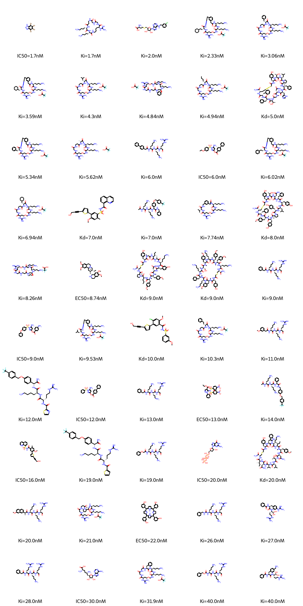
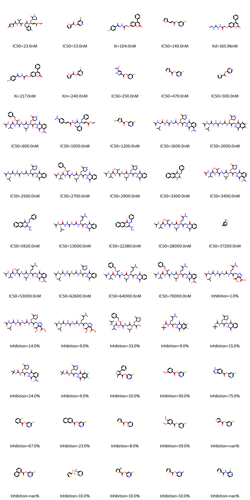

# Top 50 compounds per viral genus

#### Lentivirus

#### Hepacivirus

#### Betacoronavirus

#### Alphainfluenzavirus

#### Orthoflavivirus

#### Enterovirus

#### Lymphocryptovirus

#### Cytomegalovirus

#### Simplexvirus

#### Orthohepadnavirus

#### Mammarenavirus

#### Orthopneumovirus

#### Rhadinovirus

#### Betainfluenzavirus

#### Gammaretrovirus

#### Deltaretrovirus

#### Varicellovirus

#### Alpharetrovirus

#### Orthoebolavirus

#### Tequatrovirus

#### Hepatovirus

#### Gammacoronavirus

#### Vesiculovirus

#### Orthopoxvirus

#### Pestivirus

#### Respirovirus

#### Alphapapillomavirus

#### Norovirus

#### Betapolyomavirus

#### Alphacoronavirus

#### Chlorovirus

#### Lambdavirus

#### Teseptimavirus

#### Novirhabdovirus

#### Mastadenovirus

#### Orthoavulavirus

#### Alphavirus

#### Morbillivirus

#### Avihepadnavirus

#### Roseolovirus

#### Henipavirus

#### Cripavirus

#### Sinsheimervirus

#### Alphamesonivirus

#### Gammainfluenzavirus

#### Betaretrovirus

#### Cardiovirus

#### Corticovirus

#### Potyvirus

#### Teetrevirus

#### Lyssavirus

#### Mupapillomavirus

#### Teschovirus

#### Kappapapillomavirus

#### Enamovirus

#### Svunavirus

