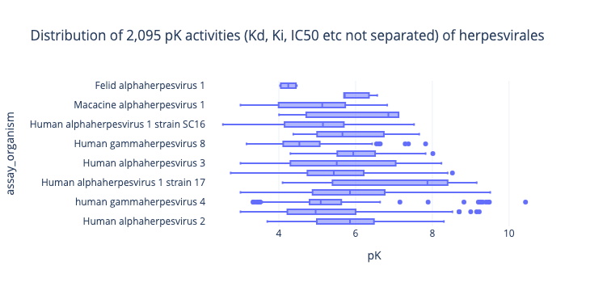
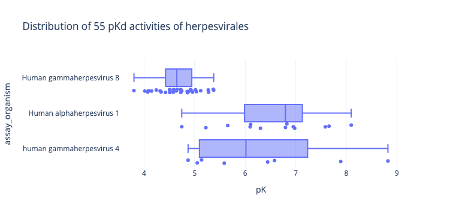

# Test case: Herpesviridales

I have the problem that I am losing loads of data along the way when I filter,
and I need to sanity check I am not breaking things too much.

Herpesviridales is not a viral class of critical importance to the developing world,
but makes a good test case for me.

* A known drug (aciclovir) I know is crystallised and assayed a few times
* The class has a clean set of members with numbers

1. Herpes simplex virus — genital herpes
2. Herpes simplex virus — cold sores
3. Varicella zoster virus— shingles / chickenpox
4. Epstein Barr virus —mono
5. Cytomegalovirus — breast cancer trigger I think
6. -
7. -
8. Kaposi's sarcoma

## Analysis

1. Given an NCBI taxid get all children taxids.

```python
herpesviridae_taxid = 10292
herpesvirales_taxid = 548681
```

2. Get all ChEMBL assays with those taxids
3. get all ChEMBL activities for those assays
4. get PDBs

Tax ID in assays:

* 10310	Human alphaherpesvirus 2
* 10298	Human alphaherpesvirus 1
* 10299	Human alphaherpesvirus 1 strain 17
* 10359	Human betaherpesvirus 5
* 10360	Human herpesvirus 5 strain AD169
* 10335	Human alphaherpesvirus 3
* 10338	Human herpesvirus 3 strain Dumas
* 10309	Human alphaherpesvirus 1 strain SC16
* 10358	Cytomegalovirus
* 10376	human gammaherpesvirus 4
* 10325	Macacine alphaherpesvirus 1
* 37296	Human gammaherpesvirus 8
* 10334	Felid alphaherpesvirus 1
* 2725057	Herpesviridae sp.
* 10368	Human betaherpesvirus 6


The original plan was using Papyrus, but it's stuck on ChEMBL34
and target_id is the key and I am struggle to match them

So if I need to uniprot to taxid,
I might try the new 

Whereas there are lots of measurements



Binding affinities are uncommon



Doing a PDB search, gives 5 cases of non-physiological (=drug design) compounds
bond to Herpesvirales members:

DNA polymerase 1 (HSV1): PDB: 8V1T (Aciclovir) PDB:7LUF PDB:8VQ2


protease of CMV (PDB:1NKM (native),  PDB:8J3T PDB:7TCZ)


However, these are absent in the papyrus and biochemgraph datasets.

Matching Uniprot accessions in the full datasets to NCBI tax ids and filtering for Herpesvirales gives nothing,
for either.

In terms of aciclovir, two cases come up, one human, the other mycobacterial.

| PDBID_protein   | AID           | target_id   | TID                  | accession   |   uniprot_tax_id |
|:----------------|:--------------|:------------|:---------------------|:------------|-----------------:|
| 1pwy            | CHEMBL4369203 | P00491_WT   | ChEMBL:CHEMBL4338    | P00491      |             9606 |
| 3ix2            | CHEMBL1176015 | P9WP01_WT   | ChEMBL:CHEMBL1169594 | P9WP01      |           233413 |

In other words, the ChEMBL search and the PDB searches should be separate searches
as not all datapoints are matched, possibly because there are different strains etc.

## Evaporating target_ids

Given a random selection of assays belonging to the clade

|   assay_id |    tid | description                                                                                                                                                                                                                            |
|-----------:|-------:|:---------------------------------------------------------------------------------------------------------------------------------------------------------------------------------------------------------------------------------------|
|     524689 |  22226 | Inhibition of 12-O-tetradecanoylphorbol-13-acetate induced EBV-early antigen activation in human Raji cells assessed as EA activation at 1000 molar ratio after 48 hrs relative to TPA                                                 |
|    2146347 |  22226 | Modulation of Gal4-fused VP16 expressed in SKNBE(2) cells co-transfected with UAS repoter gene assessed as increase in luciferase activity at 0.5 to 5 uM incubated for 18 hrs by luciferase reporter gene assay                       |
|    1455745 | 100288 | Allosteric modulatory activity at FLAG-tagged wild type human cytomegalovirus US28 receptor expressed in HEK293T cells by PathDetectElk1 assay relative to basal level                                                                 |
|    2081645 |  22226 | Inhibition of recombinant EpsteinBarr virus Transmembrane domain 5 of latent membrane protein 1 transformed into Escherichia coli FHK12 cells assessed as disruption of oligomerization by measuring ToxR transcription activity assay |
|     207818 |  10125 | Maximum velocity constant of the rate of phosphorylation was determined against HSV thymidine kinase                                                                                                                                   |

The `target_id==22226` does not map to anything in `target_components`

|    tid |   component_id |   targcomp_id |   homologue |
|-------:|---------------:|--------------:|------------:|
|  10125 |           1212 |          1416 |           0 |
| 100288 |           2578 |          2639 |           0 |

But does in `target_dictionary`

|    tid | target_type    | pref_name                              |   tax_id | organism                                                           | chembl_id    |   species_group_flag |
|-------:|:---------------|:---------------------------------------|---------:|:-------------------------------------------------------------------|:-------------|---------------------:|
|  10125 | SINGLE PROTEIN | Thymidine kinase, cytosolic            |     9606 | Homo sapiens                                                       | CHEMBL2883   |                    0 |
|  22226 | UNCHECKED      | Unchecked                              |      nan |                                                                    | CHEMBL612545 |                    0 |
| 100288 | SINGLE PROTEIN | Human herpesvirus 5 chemokine receptor |    10360 | Human cytomegalovirus (strain AD169) (HHV-5) (Human herpesvirus 5) | CHEMBL4259   |                    0 |

tid==22226 features in 478 assays (most common target id)


